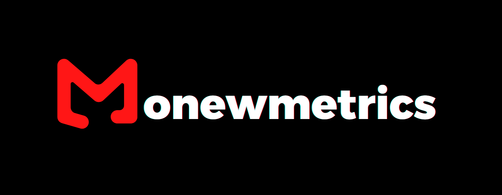

  

  

## 👋 Hello, I'm Mbarak Abubakar

I'm a third-year **Business and Finance** student, with almost **three years of experience** working in entry-level finance and accounting roles.

While I don’t come from a traditionally quantitative background, I’ve always been curious about how data and numbers can tell deeper stories especially in the world of finance. I began learning on my own using free resources online, and eventually saved up to take a Data Science course, which gave me a solid technical foundation and later further reinforced by **analytics coursework** in college and university.

Although I enjoy the **qualitative and fundamental** side of financial markets (evaluating businesses, industries, and narratives), I’ve also developed a real passion for **data-driven analysis** and **statistics & probability**, especially when it comes to **understanding how markets move** and how data can help make sense of it all.

That’s what led me to create **Monewmetrics**, a space where I can **learn, document, and share**. 

The content here reflects my ongoing learning journey and the topics I'm genuinely curious about and actively working to understand better, often with a view to applying them in real-world scenarios.

 

## This website has 3 areas:

### 📈[Quantitative Research](https://mjabubakar22.github.io/MJ-Monewmetrics/Quant/)

This is where I explore **quantitative methods** to analyze financial and economic data using **econometric models** and **machine learning algorithms**. I believe that, especially in the short term, **data-driven approaches** are often the most effective way to understand markets.

> *“My approach was to ignore the crowd and base my decisions on quantitative evidence.”*  
> — Edward Thorp (Pioneer of Quantitative Finance)

All of my research is conducted in **Python**, primarily within a **Jupyter Notebook** environment using the **Anaconda** distribution. Since the emergence of **Generative AI tools** like ChatGPT, I've increasingly used them to assist with coding, so most of the code in projects posted after 2022 is **AI-assisted**.

  

### 📊 [Statistics & Probability](https://mjabubakar22.github.io/MJ-Monewmetrics/Stats/)

This section is where I explore both foundational and advanced concepts in **statistics and probability**  including topics like **measures of central tendency and dispersion**, **regression assumptions**, **hypothesis testing**, and **statistical inference**, etc.

It's part **study journal**, part **reference toolkit** a way for me to solidify my understanding and build statistical intuition, especially as I apply these concepts to data-heavy finance projects.

> *“Understanding how to handle randomness is one of the most important skills you can develop.”*  
> — *Nassim Nicholas Taleb*

Although I’ve used paid resources like *[Practical Statistics for Data Scientists (https://www.oreilly.com/library/view/practical-statistics-for/9781491952955/)*, I often rely on high-quality, freely available resources as well. Some of my favorites include: [**Introductory Statistics – OpenStax** (Rice University)](https://assets.openstax.org/oscms-prodcms/media/documents/IntroductoryStatistics-OP_i6tAI7e.pdf)  and
[**3Blue1Brown’s Visual Lessons**](https://www.3blue1brown.com/topics/probability)

  

### 💼 [Financial Analysis](https://mjabubakar22.github.io/MJ-Monewmetrics/Finance/)

This section is a bit different from the other two, it’s more of a **meta section** , but I’ve included it to keep all my company-specific or broader financial analysis organized and easy to navigate.

Here, I dive into individual companies that I’m personally interested in for **long-term investing**. Since long-term decisions require a more **fundamental** rather than purely **quantitative** approach, this section leans more into traditional financial analysis. I share these insights on my [**LinkedIn**](https://www.linkedin.com/in/mbarak-abubakar/) or [**Seeking Alpha**](https://seekingalpha.com/user/52414763/instablogs).

I apply **equity research best practices**, including **3-statement financial modeling**, **Discounted Cash Flow (DCF) valuations**, **Qualitative deep-dives** into business models, competitive advantages (moats), industry dynamics, and key macro/microeconomic drivers etc.

> *“Know what you own, and know why you own it.”*  
> — *Peter Lynch*

While it may not be as code-heavy or technical as the other sections, it's still a side I enjoy doing and is a core part of how I think about markets and businesses while also grounded in structured analysis and real-world application.

  

---

::: {.callout-warning title="Disclaimer"}
*The content on this site is for **educational and informational purposes only** and does **not constitute financial advice**. I am not a financial advisor, and nothing here should be taken as investment guidance.*

*Always do your own research or consult with a qualified professional. I accept **no responsibility** for any loss (or gain) resulting from the use of this content.*
:::
